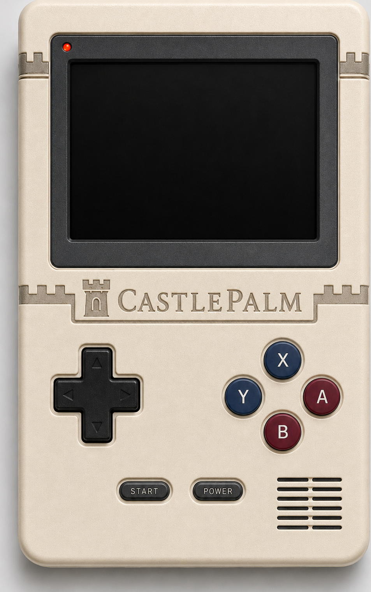

# Castle Arcade

<p align="center"></p>

A small browser arcade for the **CastlePalm** fantasy 16-bit console (the 16-bit
successor to [Dragon Palm](https://github.com/0xe25f/dragon-palm)) —
pick a cartridge and play. Two front-ends share one machine:

- **`index.html`** — the **CastlePalm** handheld (portrait casing, on-screen D-pad
  and buttons; keyboard works too).
- **`console.html`** — the **CastleStation** TV console: a big integer-scaled
  screen with **two-player** controls (keyboard split + Gamepad API). The same
  cartridges run on both.

It's a fully static site: the two HTML shells, the engine bundle
`dist/castlepalm.js` (the real CPU + PPU + APU, with the cartridges embedded so it
runs even from `file://`), the handheld casing image, and a `carts/` folder of
`.cpc` cartridges. No build step here.

## Cartridges

| File | Title | Players |
| --- | --- | --- |
| `palmblast.cpc` | **PalmBlast** (Bomberman-style arena) | 2 |
| `gryphon.cpc` | **Gryphon Ascent** (horizontal shoot-'em-up) | 1 |
| `oathbound.cpc` | **Oathbound** (side-scrolling platformer) | 1 |
| `pong.cpc` | Pong | 1 |
| `snake.cpc` | Snake | 1 |

Each shell has a cartridge bar at the top (click a title), plus **Load cartridge…**
to run any `.cpc` from disk, and drag-and-drop onto the screen.

## Controls

**PalmBlast** (best on CastleStation, `console.html`): press **Start** to begin a
round, last knight standing wins.

- 🟢 **P1** — `W A S D` move · `F` drop bomb · `Q` start
- 🔴 **P2** — arrow keys move · `.` drop bomb · `Enter` start
- USB/Bluetooth **gamepads** auto-map to P1 / P2.

On the handheld (`index.html`), the on-screen D-pad / A·B·X·Y / Start map to one
player (arrow keys / `Z X C V` / `Enter` on the keyboard).

**Gryphon Ascent** (1P horizontal shooter): **Start** to begin, **D-pad** to fly,
**A** to fire (rightward), **X** to drop a smart-bomb. Shoot enemies, grab gems to
build your combo multiplier, and dodge the bullet patterns. (Keyboard: arrows + `Z` + `C`.)

**Oathbound** (1P side-scrolling platformer): **Start** to begin, **D-pad** to move,
**B** to jump (hold for height; Down+B drops through one-way platforms), **A** to run,
**Y** to swing your sword, **X** to throw a dagger. Clear each zone by reaching the
portcullis; beat the bosses. (Keyboard: arrows + `X` jump / `Z` run / `V` sword / `C` dagger.)

## Run locally

It's self-contained (carts are embedded in the engine), so **just open
`index.html`** — `file://` works. A static server also works if you prefer:

```sh
python3 -m http.server   # then open http://localhost:8000
```

## Host it yourself

This is a fully static, self-contained site — **no build step, no server code, no
secrets or accounts required.** Everything needed to run is in this repo. Serve the
files on any static host (GitHub Pages, Netlify, Cloudflare Pages, your own web
server…), or just open `index.html` locally.

## Make your own game

CastlePalm is a real, programmable console — not just these three carts. Write your
own game in assembly, build a `.cpc`, and load it right here (**Load cartridge…** or
drag it onto the screen). The spec, assembler, worked examples, and a 5-minute
quickstart live in the **[CastlePalm SDK](https://github.com/EdwardAThomson/castlepalm-sdk)**.

Your games are yours: the engine is noncommercial, but you may distribute and **sell**
the cartridges you make (see the SDK's Cartridge Exception).

## License

[PolyForm Noncommercial 1.0.0](LICENSE.md) — free to use, modify, and share for
**noncommercial** purposes (hobby, learning, personal play); commercial use
requires permission. © 2026 Edward Thomson.
